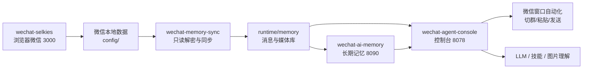

# WeChatAgent · Linux 微信记忆与自动回复套件

WeChatAgent 把 Linux 微信窗口、聊天同步、长期记忆、AI 接话、技能系统和可视化控制台打包成一套 Docker Compose 服务。目标是：在 NAS 或另一台电脑上登录微信后，直接拥有一个可观察、可配置、可扩展的微信群 Agent。

> 默认不会把模型密钥、微信数据库、登录数据、运行记忆上传到 GitHub 或镜像。新机器部署后需要自己登录微信并配置模型。

## 功能总览

| 模块 | 能力 |
| --- | --- |
| 浏览器微信 | 通过 `wechat-selkies` 在浏览器里操作 Linux 微信，默认端口 `3000` |
| 聊天同步 | 只读解密微信数据库，增量同步消息、成员、媒体和会话状态 |
| 长期记忆 | 消息索引、事实库、人物画像、群摘要、知识图谱、关系视图 |
| 自动回复 | 评分阈值判断、@ 必回、群组自动切换、随机延迟、避免回复自己 |
| 技能系统 | 支持 `SKILL.md`、内置技能、OpenAPI/HTTP 技能、导入导出、权限开关、运行日志 |
| 内置技能 | 网络搜索、斗图发图、公众号标题识别、图片理解 |
| 群日报 | 基于真实聊天记录生成图文日报，可作为图片发送到群 |
| 图片记忆库 | 群图解析、标签入库、画廊展示、失败重试、按群导入导出 |
| 控制台 | 服务状态、模型配置、模式参数、回复实时状态、宇宙总览、排行榜 |
| 数据维护 | 按群导出/导入、全量备份、运行数据恢复 |

## 服务架构



## 快速部署

### 1. 准备环境

需要一台已安装 Docker 和 Docker Compose 的机器。

当前发布镜像支持 `linux/amd64` 和 `linux/arm64`。x86 NAS、Intel/AMD Linux 服务器、ARM NAS、Apple Silicon 都使用同一套 Compose；默认会自动按宿主机架构拉取镜像。

```bash
git clone https://github.com/xiaoguiwucan/linux-wechat-agent.git
cd linux-wechat-agent
cp .env.example .env
```

完整部署需要 GitHub 仓库里的 `docker-compose.yml`、脚本和解密工具；DockerHub 镜像只承载项目服务程序。

默认端口只绑定本机 `127.0.0.1`。如果要让局域网访问，把 `.env` 里的这些值改成 `0.0.0.0`：

```env
HTTP_BIND=0.0.0.0
AGENT_CONSOLE_BIND=0.0.0.0
AI_MEMORY_BIND=0.0.0.0
```

### 2. 启动微信窗口并登录

```bash
docker compose up -d wechat-selkies
```

打开：

- 微信窗口：[http://127.0.0.1:3000](http://127.0.0.1:3000)

扫码登录微信，进入几个常用群，让微信把最近会话和数据库文件落到 `config/`。

### 3. 自动检测微信账号目录

```bash
./scripts/detect-wechat-account.sh
```

脚本会在 `.env` 写入：

```env
WECHAT_ACCOUNT_DIR_NAME=wxid_xxx_xxxx
```

### 4. 提取数据库 key

保持微信窗口在线，然后运行：

```bash
./scripts/extract-wechat-keys.sh
```

成功后会生成：

```text
runtime/wechat-decrypt/keys/all_keys.json
runtime/wechat-decrypt/config.json
```

### 5. 启动完整套件

```bash
docker compose up -d
```

打开控制台：

- Agent 控制台：[http://127.0.0.1:8078](http://127.0.0.1:8078)
- AI 记忆 API：[http://127.0.0.1:8090](http://127.0.0.1:8090)

进入控制台后，先在“模型”页面配置自己的 LLM。模型跑在宿主机时，容器里推荐填：

```text
http://host.docker.internal:端口/v1
```

## 本地开发

发布部署默认拉 DockerHub 镜像。开发当前源码时使用 build 覆盖文件：

```bash
./scripts/dev-up.sh
```

或手动执行：

```bash
docker compose -f docker-compose.yml -f docker-compose.build.yml up -d --build
```

## 常用命令

查看服务：

```bash
docker compose ps
docker compose logs -f wechat-agent-console
```

重启控制台：

```bash
docker compose restart wechat-agent-console
```

备份私有运行数据：

```bash
./scripts/backup.sh
```

恢复备份：

```bash
./scripts/restore.sh backups/wechat-agent-backup-YYYYMMDD-HHMMSS.tar.gz
```

升级镜像：

```bash
docker compose pull
docker compose up -d
```

## 发布到 DockerHub

先登录 DockerHub：

```bash
docker login
```

构建并推送：

```bash
./scripts/publish-dockerhub.sh docker.io/xiaoguiwucan/linux-wechat-agent 0.2.0
```

如果你的 DockerHub 用户名不同，把命令和 `.env` 里的 `WECHAT_AGENT_IMAGE` 改成你的镜像名。

## 数据与安全边界

这些内容不会进入 GitHub，也不会进入 Docker 镜像：

- `.env`
- `config/` 微信登录与原始本地数据
- `runtime/` 运行数据库、记忆库、密钥、媒体缓存
- `all_keys*.json`
- 模型 API Key、Tavily Key、图片理解模型 Key
- 备份包 `backups/`

请不要把备份包或运行目录公开上传。

## 更多文档

- [NAS 部署指南](docs/DEPLOY_NAS.md)
- [完整功能介绍](docs/FEATURES.md)
- [DockerHub 发布说明](docs/DOCKERHUB.md)
- [GitHub Release 流程](docs/GITHUB_RELEASE.md)
- [本地开发记录](README.local.md)
