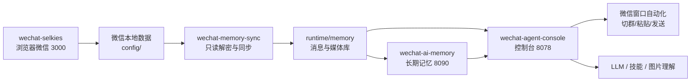

<div align="center">

# WeChatAgent

### Linux 微信记忆与自动回复套件

<p>
  <strong>把浏览器微信、聊天同步、长期记忆、AI 接话、技能系统、图片理解和可视化控制台打包成一套 Docker Compose 服务。</strong>
</p>

<p>
  <a href="https://github.com/xiaoguiwucan/linux-wechat-agent">
    
  </a>
  <a href="https://hub.docker.com/r/xiaoguiwucan/linux-wechat-agent">
    
  </a>
  
  
</p>

<p>
  <code>微信窗口 3000</code>
  ·
  <code>控制台 8078</code>
  ·
  <code>AI 记忆 8090</code>
  ·
  <code>Docker Compose 一套部署</code>
</p>

</div>

WeChatAgent 把 Linux 微信窗口、聊天同步、长期记忆、AI 接话、技能系统和可视化控制台打包成一套 Docker Compose 服务。目标是：在 NAS 或另一台电脑上登录微信后，直接拥有一个可观察、可配置、可扩展的微信群 Agent。

> 默认不会把模型密钥、微信数据库、登录数据、运行记忆上传到 GitHub 或镜像。新机器部署后需要自己登录微信并配置模型。

## 功能总览

| 模块 | 能力 |
| --- | --- |
| 浏览器微信 | 通过 `wechat-selkies` 在浏览器里操作 Linux 微信，默认端口 `3000` |
| 聊天同步 | 只读解密微信数据库，增量同步消息、成员、媒体和会话状态 |
| 长期记忆 | 消息索引、事实库、人物画像、群摘要、知识图谱、关系视图 |
| 自动回复 | 评分阈值判断、@ 必回、群组自动切换、随机延迟、避免回复自己 |
| 技能系统 | 支持 `SKILL.md`、内置技能、OpenAPI/HTTP 技能、导入导出、权限开关、运行日志 |
| 内置技能 | 网络搜索、斗图发图、公众号标题识别、图片理解 |
| 群日报 | 基于真实聊天记录生成图文日报，可作为图片发送到群 |
| 图片记忆库 | 群图解析、标签入库、画廊展示、失败重试、按群导入导出 |
| 控制台 | 服务状态、模型配置、模式参数、回复实时状态、宇宙总览、排行榜 |
| 数据维护 | 按群导出/导入、全量备份、运行数据恢复 |

## 版本更新

> 每一个发布版本都必须写入 `CHANGELOG.md`。发布脚本会自动检查更新日志，缺少对应版本记录会拒绝发布镜像。

<table>
  <tr>
    <td width="20%" align="center">
      <h3>v0.4.1</h3>
      <strong>接话排除名单增强</strong><br>
      <sub>2026-06-19</sub><br><br>
      
    </td>
    <td>
      <strong>新增</strong>
      <ul>
        <li>按群配置“排除接话成员”，被排除成员发言或 @ 机器人都会跳过。</li>
        <li>排除成员支持群员搜索，可按群昵称、昵称、alias、member username 快速过滤。</li>
        <li>新增“当前群已排除成员”标签列表，可直观看到被排除的人并一键移除。</li>
      </ul>
      <strong>优化</strong>
      <ul>
        <li>接话评分、候选扫描和最终发送执行三层统一遵守排除名单。</li>
        <li>排除匹配同时参考 member username、alias、群昵称、备注、昵称和同步联系人信息。</li>
        <li>编辑自动回复配置时，状态轮询不会再覆盖正在操作的排除名单表单。</li>
      </ul>
      <strong>修复</strong>
      <ul>
        <li>修复排除成员面板初次打开时可能一直显示“等待同步群聊列表”。</li>
        <li>修复清空排除名单后旧配置键仍残留的问题。</li>
        <li>修复搜索过滤后勾选成员时，隐藏的已排除成员可能被误删的问题。</li>
      </ul>
    </td>
  </tr>
  <tr>
    <td align="center">
      <h3>v0.4.0</h3>
      <strong>登录守护与记忆控制台增强</strong><br>
      <sub>2026-06-19</sub><br><br>
      
    </td>
    <td>
      <strong>新增</strong>
      <ul>
        <li>Clawbot 微信掉线通知、重复提醒、手动检查和登录确认守护。</li>
        <li>微信窗口视觉状态检测：区分 <code>login_required</code>、<code>login_pending</code> 和真实聊天界面。</li>
        <li>记忆库管理、按群导出/导入、照片库画廊、图片解析入库和失败重试流程。</li>
        <li>图片理解 Skill 的模型配置、连通性测试和上传图片测试能力。</li>
        <li>证据驱动人物画像重建、进度状态、画像标签和关系数据增强。</li>
      </ul>
      <strong>优化</strong>
      <ul>
        <li>总览宇宙、排行榜、等级视觉、不同分辨率下的布局自适应。</li>
        <li>自动回复的群组路由、蓝色 @、忽略自己消息、斗图触发和实时状态展示。</li>
        <li>群总结模板、昵称映射、记忆库检索和图片总结展示效果。</li>
      </ul>
      <strong>修复</strong>
      <ul>
        <li>修复微信掉线后被 <code>sync_worker_fresh</code> 误判为“已恢复在线”的问题。</li>
        <li>修复登录页“我知道了”和“登录”自动点击坐标，并在手机确认前保持等待状态。</li>
        <li>修复多个模式参数、Skill 参数保存后刷新回退的问题。</li>
      </ul>
    </td>
  </tr>
  <tr>
    <td align="center">
      <h3>v0.3.1</h3>
      <strong>多架构镜像发布</strong><br>
      <sub>2026-06-18</sub><br><br>
      
    </td>
    <td>
      <strong>更新内容</strong>
      <ul>
        <li>DockerHub 项目服务镜像发布为 <code>linux/amd64</code> 与 <code>linux/arm64</code> 多架构 manifest。</li>
        <li>取消微信 GUI 服务默认 <code>linux/arm64</code> 平台锁定，x86 NAS 和 Intel/AMD 服务器可自动拉取对应架构。</li>
        <li>更新 NAS、x86、ARM、Apple Silicon 部署说明。</li>
        <li>发布脚本改为默认使用 <code>docker buildx build --platform linux/amd64,linux/arm64 --push</code>。</li>
      </ul>
      <strong>验证</strong>
      <ul>
        <li>确认 <code>ghcr.io/nickrunning/wechat-selkies:0.0.12-minimal</code> 同时支持 <code>linux/amd64</code> 和 <code>linux/arm64</code>。</li>
      </ul>
    </td>
  </tr>
  <tr>
    <td align="center">
      <h3>v0.3.0</h3>
      <strong>正式 Docker 部署包</strong><br>
      <sub>2026-06-18</sub><br><br>
      
    </td>
    <td>
      <strong>新增</strong>
      <ul>
        <li>生产部署向 Docker Compose 打包方案。</li>
        <li><code>.env.example</code>，避免把本地路径、密钥、运行数据写死进仓库。</li>
        <li>DockerHub 镜像工作流、本地开发 compose override、NAS/新电脑部署文档。</li>
        <li>账号目录检测、数据库 key 提取、运行数据备份、恢复、本地开发启动和镜像发布脚本。</li>
      </ul>
      <strong>调整</strong>
      <ul>
        <li>用 <code>WECHAT_ACCOUNT_DIR_NAME</code> 替代硬编码微信账号目录。</li>
        <li>控制台自动按配置发现微信数据库路径。</li>
        <li>增加 <code>host.docker.internal</code> 映射，方便容器访问宿主机模型服务。</li>
      </ul>
      <strong>安全</strong>
      <ul>
        <li>确认 <code>.env</code>、<code>config/</code>、<code>runtime/</code>、微信 key、私有数据库和备份包不会进入 Git 或镜像。</li>
      </ul>
    </td>
  </tr>
  <tr>
    <td align="center">
      <h3>v0.2.0</h3>
      <strong>自动自由接话</strong><br>
      <sub>2026-06-15</sub><br><br>
      
    </td>
    <td>
      <strong>新增</strong>
      <ul>
        <li>微信群自动自由接话 worker。</li>
        <li>基于评分阈值的自动发送模式。</li>
        <li>按群水位线，开启自动回复时不会翻旧账回复历史消息。</li>
        <li>Outbox 记录评分、阈值、决策、触发原因和发送确认。</li>
        <li>自动回复状态 API 与控制台配置：允许群、轮询间隔、随机延迟和模式参数。</li>
      </ul>
      <strong>调整</strong>
      <ul>
        <li>自动回复复用已验证的微信 UI 发送器：切群、粘贴、校验输入框、再发送。</li>
        <li>微信窗口操作串行化，多个群的评分和扫描可以并行覆盖。</li>
        <li>连续回复同一个群时复用当前聊天窗口，不重复搜索群名。</li>
      </ul>
    </td>
  </tr>
  <tr>
    <td align="center">
      <h3>v0.1.0</h3>
      <strong>手动微信发送闭环</strong><br>
      <sub>2026-06-15</sub><br><br>
      
    </td>
    <td>
      <strong>新增</strong>
      <ul>
        <li>控制台生成回复后，可以手动粘贴到微信或发送到微信。</li>
        <li>自动切换目标群：支持 <code>值班群</code> 和 <code>PT站看片狂魔小群</code>。</li>
        <li>短关键词搜索：<code>值班群</code> 搜索 <code>值班</code>，<code>PT站看片狂魔小群</code> 搜索 <code>PT</code>。</li>
        <li>群切换和发送动作支持随机延迟。</li>
        <li>回复 outbox 记录草稿和发送尝试。</li>
      </ul>
      <strong>修复</strong>
      <ul>
        <li>修复预览状态残留导致回复发到上一个群的问题。</li>
        <li>修复完整群名搜索打开微信全局搜索页的问题。</li>
        <li>修复小尺寸微信窗口识别、Selkies 剪贴板粘贴和输入框校验可靠性。</li>
      </ul>
    </td>
  </tr>
</table>

## 服务架构



## 快速部署

### 1. 准备环境

需要一台已安装 Docker 和 Docker Compose 的机器。

当前发布镜像支持 `linux/amd64` 和 `linux/arm64`。x86 NAS、Intel/AMD Linux 服务器、ARM NAS、Apple Silicon 都使用同一套 Compose；默认会自动按宿主机架构拉取镜像。

```bash
git clone https://github.com/xiaoguiwucan/linux-wechat-agent.git
cd linux-wechat-agent
cp .env.example .env
```

完整部署需要 GitHub 仓库里的 `docker-compose.yml`、脚本和解密工具；DockerHub 镜像只承载项目服务程序。

默认端口只绑定本机 `127.0.0.1`。如果要让局域网访问，把 `.env` 里的这些值改成 `0.0.0.0`：

```env
HTTP_BIND=0.0.0.0
AGENT_CONSOLE_BIND=0.0.0.0
AI_MEMORY_BIND=0.0.0.0
```

### 2. 启动微信窗口并登录

```bash
docker compose up -d wechat-selkies
```

打开：

- 微信窗口：[http://127.0.0.1:3000](http://127.0.0.1:3000)

扫码登录微信，进入几个常用群，让微信把最近会话和数据库文件落到 `config/`。

### 3. 自动检测微信账号目录

```bash
./scripts/detect-wechat-account.sh
```

脚本会在 `.env` 写入：

```env
WECHAT_ACCOUNT_DIR_NAME=wxid_xxx_xxxx
```

### 4. 提取数据库 key

保持微信窗口在线，然后运行：

```bash
./scripts/extract-wechat-keys.sh
```

成功后会生成：

```text
runtime/wechat-decrypt/keys/all_keys.json
runtime/wechat-decrypt/config.json
```

### 5. 启动完整套件

```bash
docker compose up -d
```

打开控制台：

- Agent 控制台：[http://127.0.0.1:8078](http://127.0.0.1:8078)
- AI 记忆 API：[http://127.0.0.1:8090](http://127.0.0.1:8090)

进入控制台后，先在“模型”页面配置自己的 LLM。模型跑在宿主机时，容器里推荐填：

```text
http://host.docker.internal:端口/v1
```

## 本地开发

发布部署默认拉 DockerHub 镜像。开发当前源码时使用 build 覆盖文件：

```bash
./scripts/dev-up.sh
```

或手动执行：

```bash
docker compose -f docker-compose.yml -f docker-compose.build.yml up -d --build
```

## 常用命令

查看服务：

```bash
docker compose ps
docker compose logs -f wechat-agent-console
```

重启控制台：

```bash
docker compose restart wechat-agent-console
```

备份私有运行数据：

```bash
./scripts/backup.sh
```

恢复备份：

```bash
./scripts/restore.sh backups/wechat-agent-backup-YYYYMMDD-HHMMSS.tar.gz
```

升级镜像：

```bash
docker compose pull
docker compose up -d
```

## 发布到 DockerHub

先登录 DockerHub：

```bash
docker login
```

构建并推送：

```bash
./scripts/publish-dockerhub.sh docker.io/xiaoguiwucan/linux-wechat-agent 0.4.1
```

如果你的 DockerHub 用户名不同，把命令和 `.env` 里的 `WECHAT_AGENT_IMAGE` 改成你的镜像名。

## 数据与安全边界

这些内容不会进入 GitHub，也不会进入 Docker 镜像：

- `.env`
- `config/` 微信登录与原始本地数据
- `runtime/` 运行数据库、记忆库、密钥、媒体缓存
- `all_keys*.json`
- 模型 API Key、Tavily Key、图片理解模型 Key
- 备份包 `backups/`

请不要把备份包或运行目录公开上传。

## 更多文档

- [NAS 部署指南](docs/DEPLOY_NAS.md)
- [完整功能介绍](docs/FEATURES.md)
- [DockerHub 发布说明](docs/DOCKERHUB.md)
- [GitHub Release 流程](docs/GITHUB_RELEASE.md)
- [本地开发记录](README.local.md)
